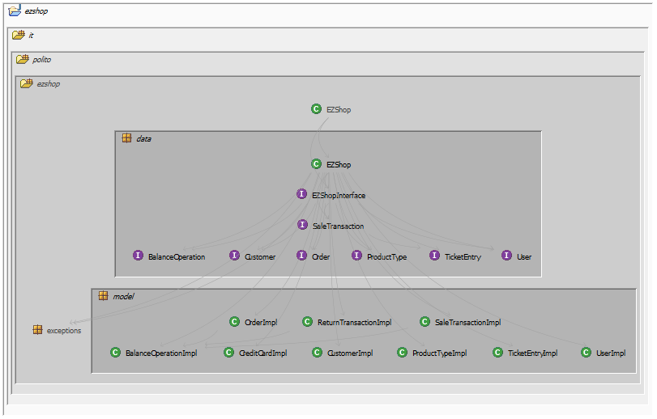
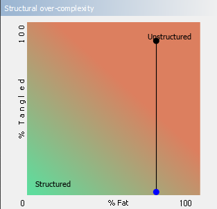
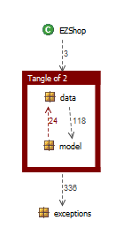

# Design assessment

# Levelized structure map

The it.polito.ezshop.exceptions package hasn not been expanded due to graphical and presentation reasons. It nevertheless didn't boast any useful information regarding the levelized structure map analyis.

# Structural over complexity chart

The project initially presented a tangle percentage of 94%, which has been proposedly reduced to 0% after cutting the backward dependencies between the packages it.polito.ezshop.model and it.polito.ezshop.data.

# Size metrics

| Metric                                    | Measure |
| ----------------------------------------- | ------- |
| Packages                                  | 6 |
| Classes (outer)                           | 38 |
| Classes (all)                             | 39 |
| NI (number of bytecode instructions)      | 5711 |
| LOC (non comment non blank lines of code) | ~ 2456 |

# Items with XS

The XS before cutting tangles is as follows.
| Item | Tangled | Fat  | Size | XS   |
| ---- | ------- | ---- | ---- | ---- |
| ezshop.it.polito.ezshop.data.EZShop | N/A | 215 | 4591 | 2028 |
| ezshop.it.polito.ezshop | 5% | 4 | 5711 | 284 |

# Package level tangles

# Summary analysis

The main difference between the two versions lies in a lower usage of the object oriented paradigm. This is due to the fact that the interface posed heavy architectural constraints that forced us to avoid using to its fullest the features of the Java language.
The current structure presents a weakness in keeping the core logic inside the wrapper class that contains all methods, instead of calling class specific methods from modular ad-hoc classes. This assessment is enforced by the analysis performed through Structure 101, which emphasized the presence of backward dependencies between the it.polito.ezshop.model and it.polito.ezshop.data packages.
