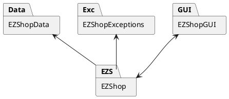
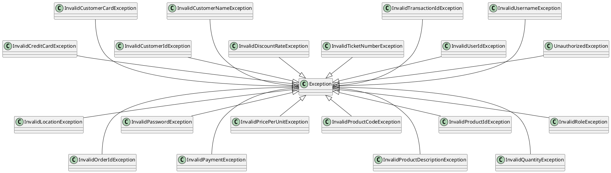

# Design Document 

Authors: Angela D'Antonio, Gabriele Inzerillo, Ruggero Nocera, Marzio Vallero

Date: 26/04/2021

Version: 1.0

# Contents

- [High level design](#package-diagram)
- [Low level design](#class-diagram)
- [Verification traceability matrix](#verification-traceability-matrix)
- [Verification sequence diagrams](#verification-sequence-diagrams)

# Instructions

The design must satisfy the Official Requirements document, notably functional and non functional requirements

# High level design 

<discuss architectural styles used, if any>
<report package diagram>

# Low level design

<for each package, report class diagram>

EZShop:

User
Role
ProductType
Order
Customer
Ticket
BalanceOperation

Exc:
InvalidCreditCardException
InvalidCustomerCardException
InvalidCustomerIdException
InvalidCustomerNameException
InvalidDiscountRateException
InvalidLocationException
InvalidOrderIdException
InvalidPasswordException
InvalidPaymentException
InvalidPricePerUnitException
InvalidProductCodeException
InvalidProductCodeException
InvalidProductDescriptionException
InvalidProductIdException
InvalidQuantityException
InvalidRoleException
InvalidTicketNumberException
InvalidTransactionIdException
InvalidUserIdException
InvalidUsernameException
UnauthorizedException

# Verification traceability matrix

\<for each functional requirement from the requirement document, list which classes concur to implement it>

# Verification sequence diagrams 
\<select key scenarios from the requirement document. For each of them define a sequence diagram showing that the scenario can be implemented by the classes and methods in the design>

