# Design Document 


Authors: Angela D'Antonio, Gabriele Inzerillo, Ruggero Nocera, Marzio Vallero

Date: 17/05/2021

Version: 1.1


# Contents

- [High level design](#package-diagram)
- [Low level design](#class-diagram)
- [Verification traceability matrix](#verification-traceability-matrix)
- [Verification sequence diagrams](#verification-sequence-diagrams)

# Instructions

The design must satisfy the Official Requirements document, notably functional and non functional requirements

# High level design 

Layered architeture whit MVC pattern.

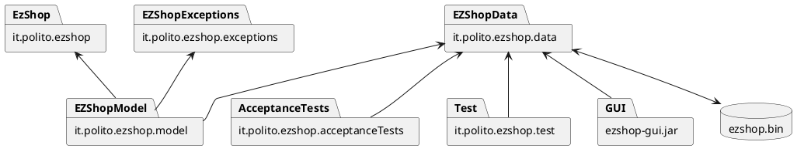
<-->

# Low level design

### it.polito.ezshop.data
```plantuml
@startuml
package it.polito.ezshop.data {
top to bottom direction

    interface "EZShopInterface" as API{
    void reset()
    -- User Management --
    Integer createUser(String username, String password, String role) 
    boolean deleteUser(Integer id) 
    List<User> getAllUsers() 
    User getUser(Integer id) 
    boolean updateUserRights(Integer id, String role)
    User login(String username, String password) 
    boolean logout()
    -- Product Management --
    Integer createProductType(String description, String productCode, double pricePerUnit, String note)
    boolean updateProduct(Integer id, String newDescription, String newCode, double newPrice, String newNote)
    boolean deleteProductType(Integer id) 
    List<ProductType> getAllProductTypes() 
    ProductType getProductTypeByBarCode(String barCode) 
    List<ProductType> getProductTypesByDescription(String description) 
    boolean updateQuantity(Integer productId, int toBeAdded) 
    boolean updatePosition(Integer productId, String newPos) 
    -- Order Management --
    Integer issueOrder(String productCode, int quantity, double pricePerUnit)
    Integer payOrderFor(String productCode, int quantity, double pricePerUnit)
    boolean payOrder(Integer orderId) 
    boolean recordOrderArrival(Integer orderId) 
    List<Order> getAllOrders() 
    -- Customer Management --
    Integer defineCustomer(String customerName) 
    boolean modifyCustomer(Integer id, String newCustomerName, String newCustomerCard) 
    boolean deleteCustomer(Integer id) 
    Customer getCustomer(Integer id) 
    List<Customer> getAllCustomers() 
    String createCard() 
    boolean attachCardToCustomer(String customerCard, Integer customerId) 
    boolean modifyPointsOnCard(String customerCard, int pointsToBeAdded) 
    -- Payment Management --
    Integer startSaleTransaction() 
    boolean addProductToSale(Integer transactionId, String productCode, int amount) 
    boolean deleteProductFromSale(Integer transactionId, String productCode, int amount) 
    boolean applyDiscountRateToProduct(Integer transactionId, String productCode, double discountRate) 
    boolean applyDiscountRateToSale(Integer transactionId, double discountRate) 
    int computePointsForSale(Integer transactionId) 
    boolean endSaleTransaction(Integer transactionId) 
    boolean deleteSaleTransaction(Integer transactionId) 
    SaleTransaction getSaleTransaction(Integer transactionId) 
    Integer startReturnTransaction(Integer transactionId) 
    boolean returnProduct(Integer returnId, String productCode, int amount) 
    boolean endReturnTransaction(Integer returnId, boolean commit) 
    boolean deleteReturnTransaction(Integer returnId) 
    double receiveCashPayment(Integer transactionId, double cash) 
    boolean receiveCreditCardPayment(Integer transactionId, String creditCard) 
    double returnCashPayment(Integer returnId) 
    double returnCreditCardPayment(Integer returnId, String creditCard) 
    boolean recordBalanceUpdate(double toBeAdded) 
    List<BalanceOperation> getCreditsAndDebits(LocalDate from, LocalDate to) 
    double computeBalance()
    }

    class EZShop {
        double balance
        User loggedUser
        HashMap<Integer, SaleTransactionImpl> openedSaleTransactions
        HashMap<Integer, SaleTransactionImpl> closedSaleTransactions
        HashMap<Integer, SaleTransactionImpl> paidSaleTransactions
        HashMap<Integer, ReturnTransactionImpl> openedReturnTransactions
        HashMap<Integer, ReturnTransactionImpl> closedReturnTransactions
        HashMap<Integer, ReturnTransactionImpl> paidReturnTransactions
        HashMap<Integer, OrderImpl> orders
        HashMap<String, ProductTypeImpl> products
        HashMap<Integer, BalanceOperationImpl> balanceOperations
        HashMap<Integer, UserImpl> users
        HashMap<Integer, CustomerImpl> customers
        HashMap<String, CreditCardImpl> creditCards

        +EZShop()
        +EZShop(int)
        -boolean creditCardIsValid(String)
        -boolean barCodeIsValid(String)
        -int RoundUp(int)
    }

    together {

        interface ProductType
        interface SaleTransaction
        interface TicketEntry
        interface User
        interface BalanceOperation
        interface Customer
        interface Order 
    }
}

ProductType -up[hidden]- EZShop 
API <|-- EZShop : <<implements>>
note right of Shop: Permanent class
@enduml
```

### it.polito.ezshop.model
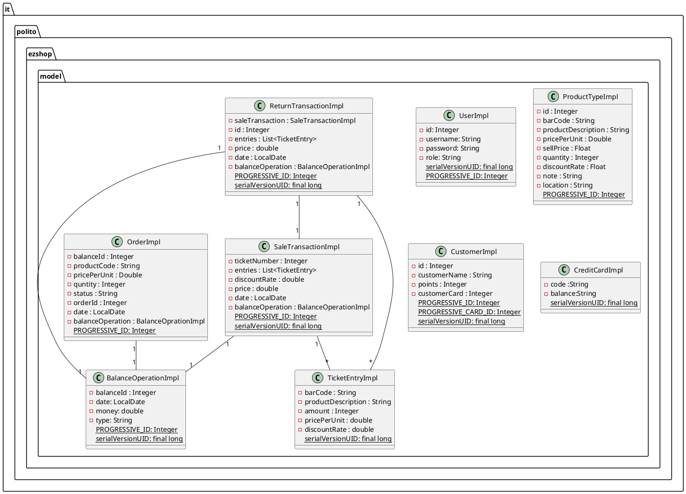

### it.polito.ezshop.exceptions
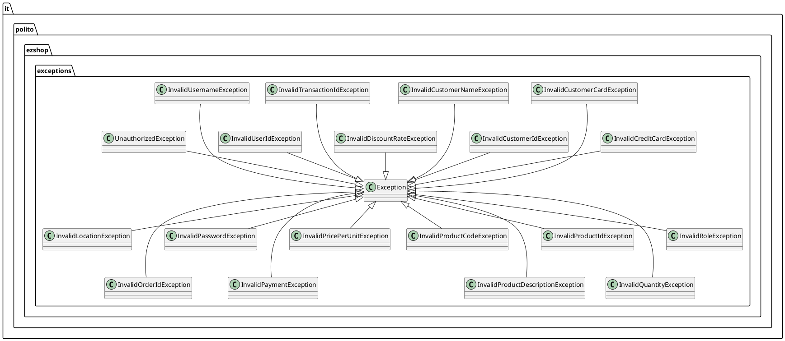

# Verification traceability matrix

| - | Shop | User | ProductType | Position | OrderState | Order | Customer | LoyaltyCard | BalanceOperation | BOType | ReturnTransaction | SaleTransaction | TransactionState |
| :--: | :--: | :--: | :--: | :--: | :--: | :--: | :--: | :--: | :--: | :--: | :--: | :--: | :--: |
| FR1 | V | V | | | | | | | | | | | |
| FR3 | V | | V | V | | | | | | | | | |
| FR4 | V | | V | V | V | V | | | | | | | |
| FR5 | V | | | | | | V | V | | | | | |
| FR6 | V | | V | | | | | | V | V | V | V | V |
| FR7 | V | | | | | | | | V | | | | |
| FR8 | V | | | | V | V | | | V | V | V | V | V |

# Verification sequence diagrams 

### Scenario 1.1
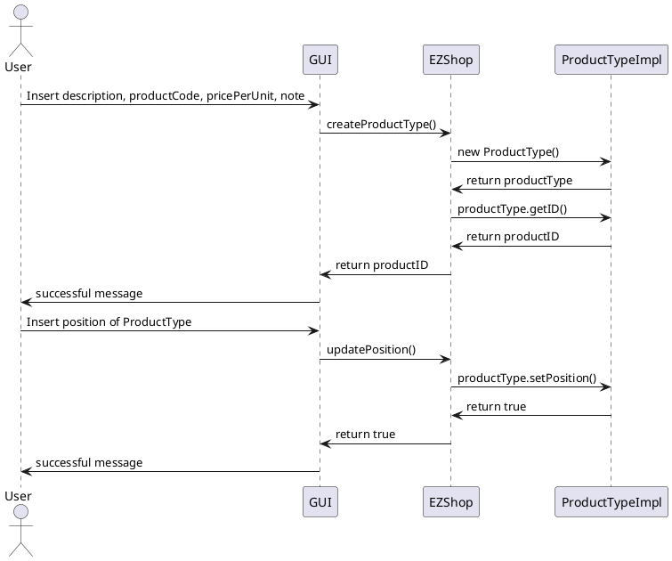

### Scenario 1.2
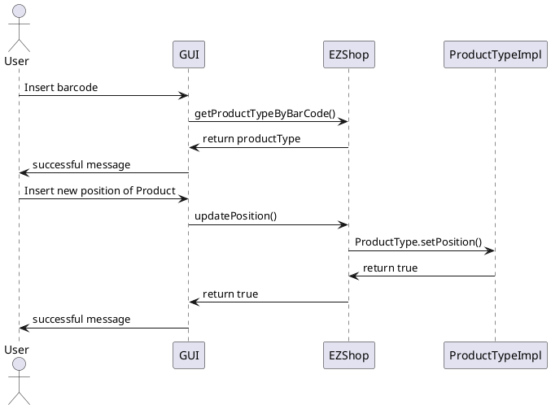


### Scenario 2.1
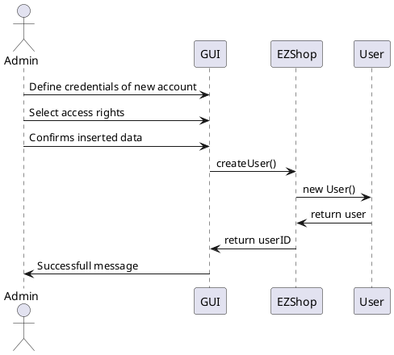

### Scenario 3.1
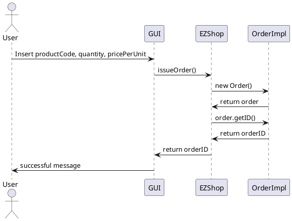

### Scenario 3.2
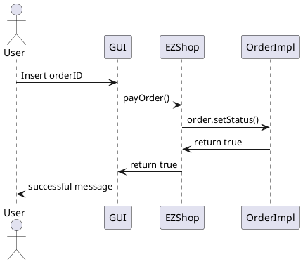

### Scenario 4.1
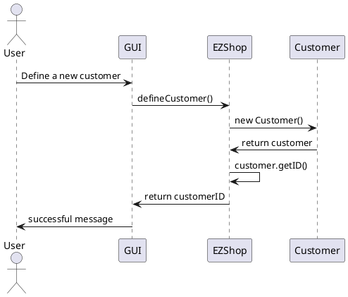

### Scenario 4.2
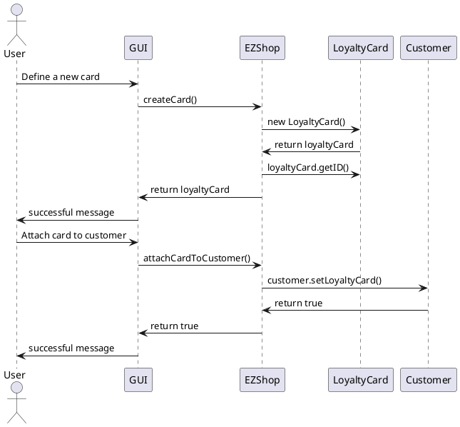

### Scenario 5.1
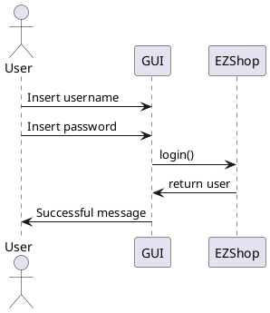

### Scenario 6.2
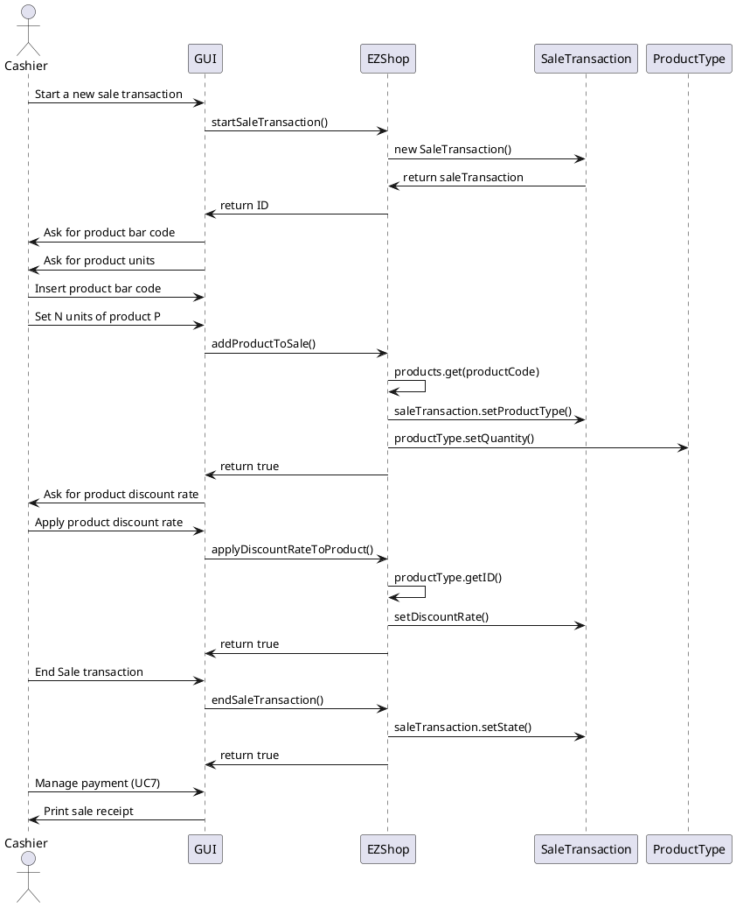

### Scenario 6.4
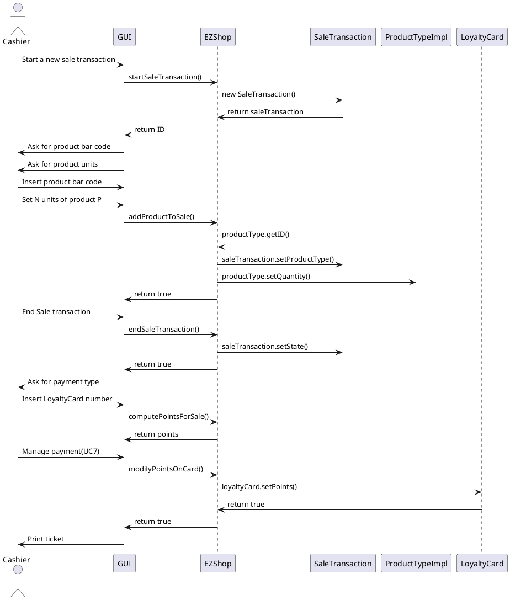

### Scenario 7.1
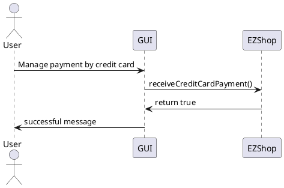

### Scenario 7.4
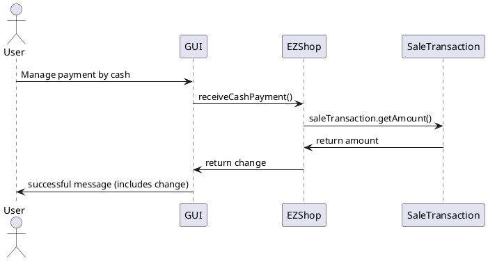
### Scenario 8.1

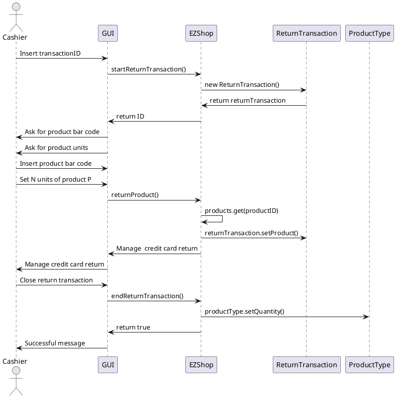
### Scenario 9.1

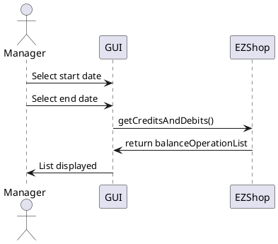

### Scenario 10.1
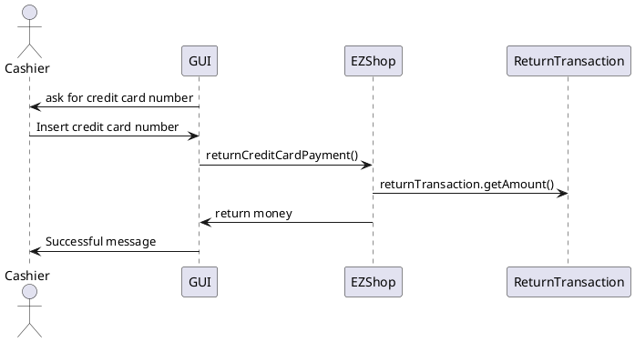
