# Design Document 

Authors: Angela D'Antonio, Gabriele Inzerillo, Ruggero Nocera, Marzio Vallero

Date: 26/04/2021

Version: 1.0

# Contents

- [High level design](#package-diagram)
- [Low level design](#class-diagram)
- [Verification traceability matrix](#verification-traceability-matrix)
- [Verification sequence diagrams](#verification-sequence-diagrams)

# Instructions

The design must satisfy the Official Requirements document, notably functional and non functional requirements

# High level design 

Layered architeture whit MVC pattern.

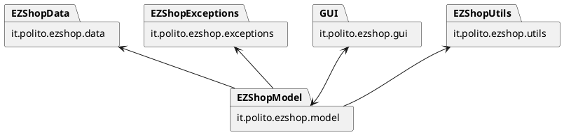

# Low level design

### it.polito.ezshop.model and it.polito.ezshop.data
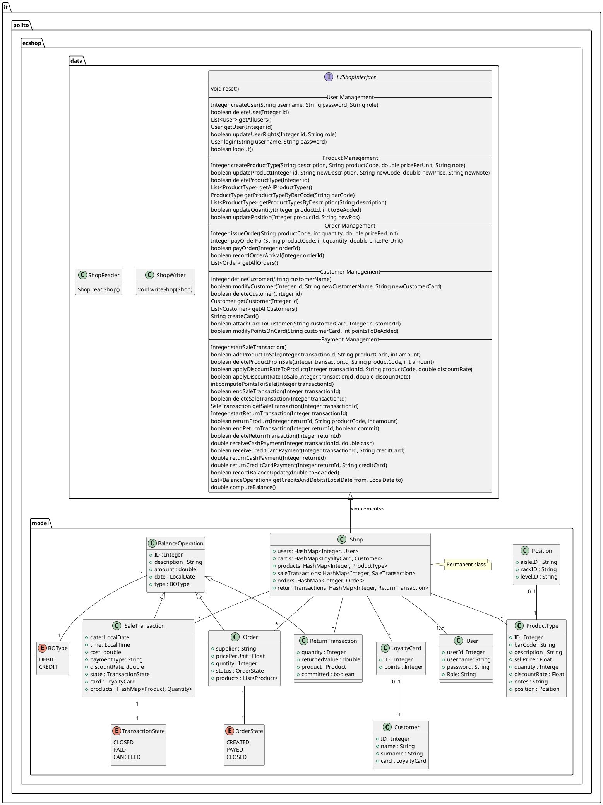

### it.polito.ezshop.exceptions
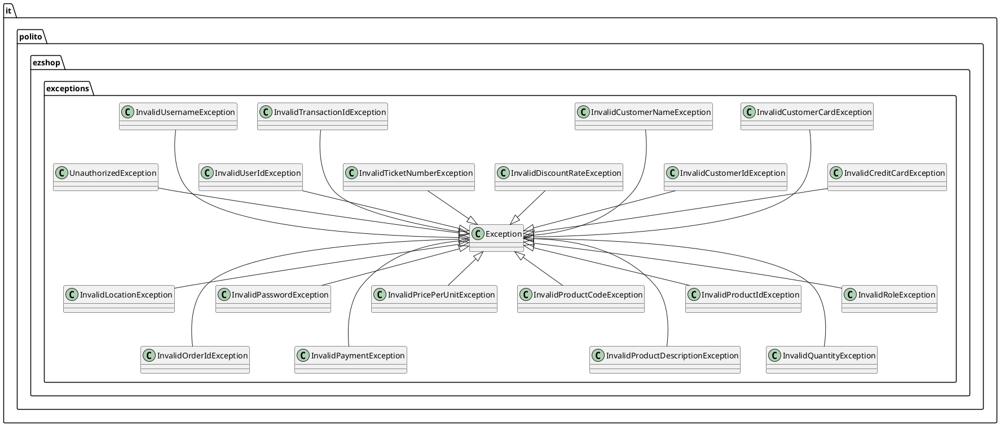

# Verification traceability matrix

| - | Shop | User | ProductType | Position | OrderState | Order | Customer | LoyaltyCard | BalanceOperation | BOType | ReturnTransaction | SaleTransaction | TransactionState |
| :--: | :--: | :--: | :--: | :--: | :--: | :--: | :--: | :--: | :--: | :--: | :--: | :--: | :--: |
| FR1 | V | V | | | | | | | | | | | |
| FR3 | V | | V | V | | | | | | | | | |
| FR4 | V | | V | V | V | V | | | | | | | |
| FR5 | V | | | | | | V | V | | | | | |
| FR6 | V | | V | | | | | | V | V | V | V | V |
| FR7 | V | | | | | | | | V | | | | |
| FR8 | V | | | | V | V | | | V | V | V | V | V |

# Verification sequence diagrams 

### Scenario 1.1
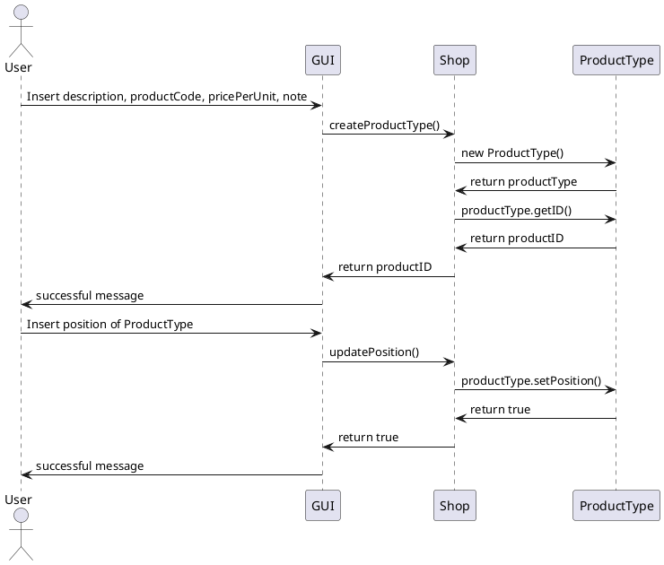

### Scenario 1.2
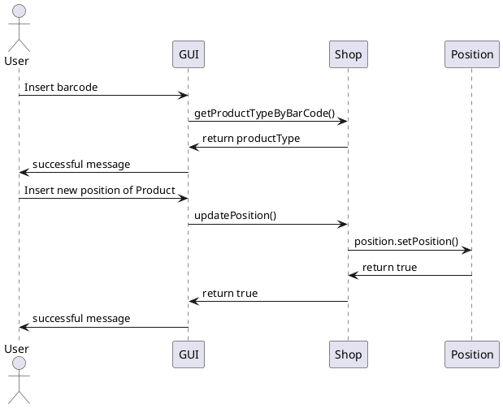

### Scenario 2.1
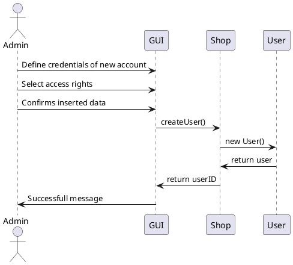

### Scenario 3.1
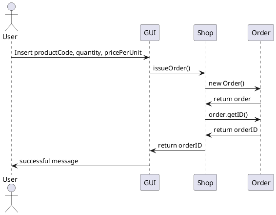

### Scenario 3.2
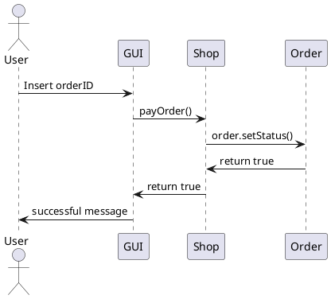

### Scenario 4.1
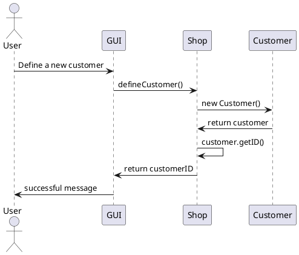

### Scenario 4.2
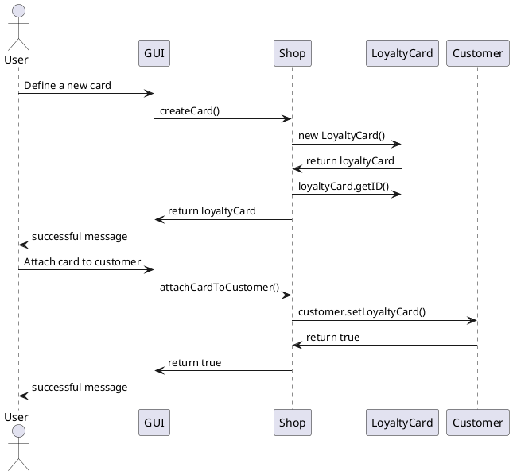

### Scenario 5.1
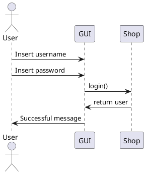

### Scenario 6.2

### Scenario 6.4
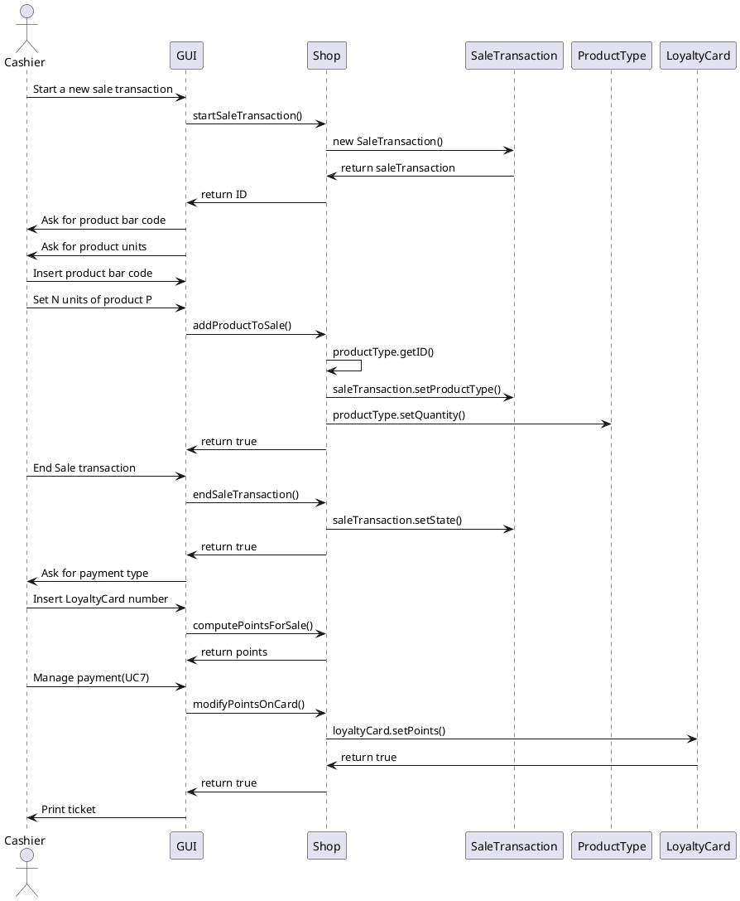

### Scenario 7.1
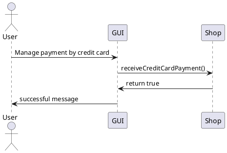

### Scenario 7.4
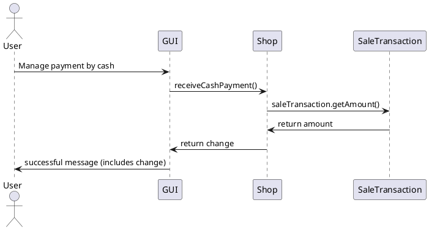
### Scenario 8.1

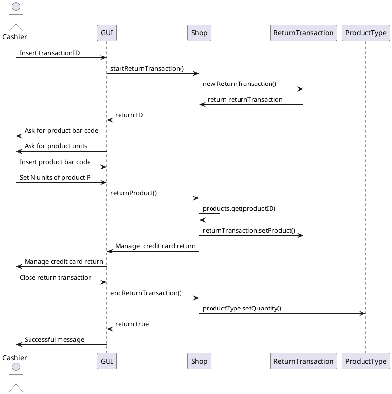
### Scenario 9.1

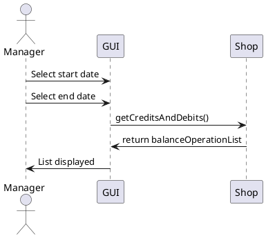

### Scenario 10.1
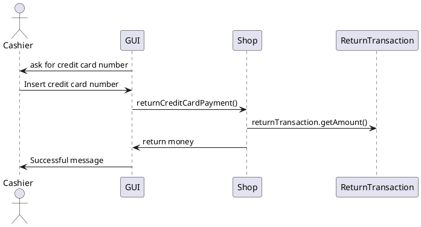