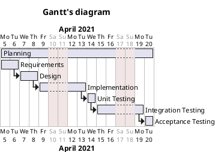

# Project Estimation  
Authors: Angela D'Antonio, Gabriele Inzerillo, Ruggero Nocera, Marzio Vallero
Date: 27/04/2021
Version: 1.1
# Contents
- [Estimate by product decomposition]
- [Estimate by activity decomposition ]
# Estimation approach
<Consider the EZGas  project as described in YOUR requirement document, assume that you are going to develop the project INDEPENDENT of the deadlines of the course>
# Estimate by product decomposition
### 
|             | Estimate                        |             
| ----------- | ------------------------------- |  
| NC =  Estimated number of classes to be developed   | 26 |             
|  A = Estimated average size per class, in LOC       | 160 | 
| S = Estimated size of project, in LOC (= NC * A) | 4160 |
| E = Estimated effort, in person hours (productivity as 10 LOC per person hour, considering implementation phase only)  | 416 |   
| C = Estimated cost, in euro (here use 1 person hour cost = 30 euro) | €12480 | 
| Estimated calendar time, in calendar weeks (Assume team of 4 people, 8 hours per day, 5 days per week ) | 3 weeks (13 days) |     

# Estimate by activity decomposition
### 
|         Activity name    | Estimated effort (person hours)   |             
| ----------- | ------------------------------- |
| Planning | 8 |
| Requirements | 55 |
| Design | 50 |
| Implementation | 85 |
| Unit testing | 30 |
| Integration testing | 95 |
| Acceptance testing | 10 |
###

