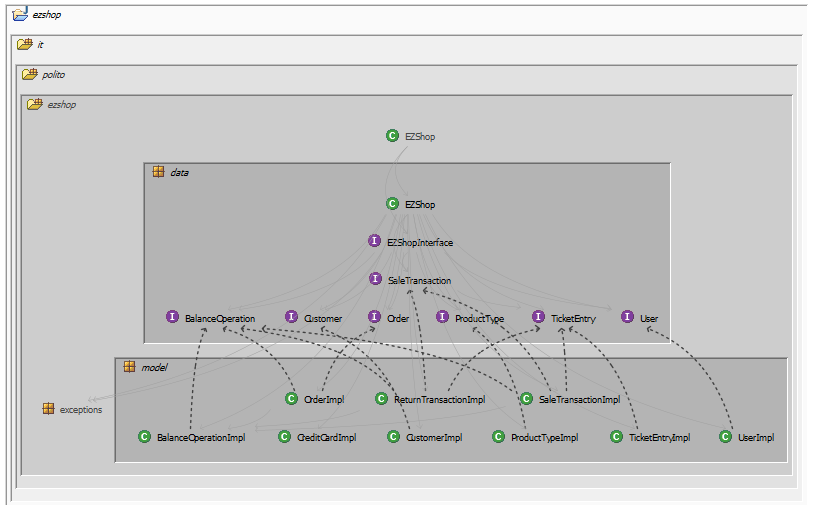
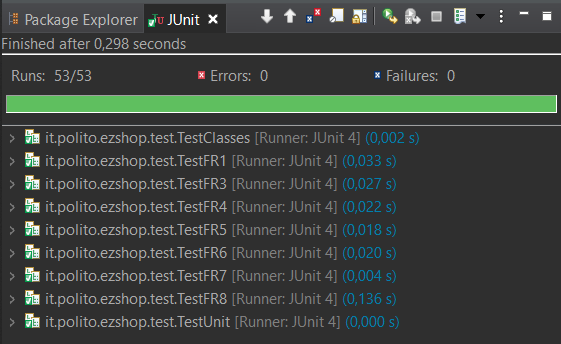

# Integration and API Test Documentation

Authors: Angela D'Antonio, Gabriele Inzerillo, Ruggero Nocera, Marzio Vallero

Date: 22/05/2021

Version: 1.0

# Contents

- [Dependency graph](#dependency graph)

- [Integration approach](#integration)

- [Tests](#tests)

- [Scenarios](#scenarios)

- [Coverage of scenarios and FR](#scenario-coverage)
- [Coverage of non-functional requirements](#nfr-coverage)

# Dependency graph 

     
# Integration approach

We used a top-down approach, starting directly from API and integrations testing of all methods together.
We divided all the methods in their respective API functional requirement group and then tested each method by initializing an independent scope in which to test all the possible inputs and exceptions in order to maximize coverage and bug discovery.
Each member in the group has been tasked with writing the test cases of a subset of the methods in the API.
Since both class testing and method testing referred to the same object, EZShop, we wrote a test method for each API method that accomplished both functionalities.
The first step has been writing in parallel all the integration tests of EZShop, then as a second step we checked for bugs and solved them.
Once that was done, all the subsequent steps delved deeper in granularity on signle classes, but the approach was exactly the same as before.

#  Tests

   <define below a table for each integration step. For each integration step report the group of classes under test, and the names of
     JUnit test cases applied to them> JUnit test classes should be here src/test/java/it/polito/ezshop

## Step 1 - Test EZShop setup
| Classes  | JUnit test cases |
|--|--|
| EZShop | class TestFR1 |
| UserImpl | class TestFR1 |
| SaleTransacitonImpl | class TestFR1 |
| ReturnTransactionImpl | class TestFR1 |
| OrderImpl | class TestFR1 |
| BalanceOperationImpl | class TestFR1 |
| CreditCardImpl | class TestFR1 |
| CustomerCardImpl | class TestFR1 |
| ProductTypeImpl | class TestFR1 |
| TicketEntryImpl | class TestFR1 |

## Step 2 - Test FR1 
| Classes  | JUnit test cases |
|--|--|
| EZShop | class TestFR1 |
| UserImpl | class TestFR1 |

## Step 3 - Test FR3
| Classes  | JUnit test cases |
|--|--|
| EZShop | class TestFR3 |
| UserImpl | class TestFR3 |
| ProductTypeImpl | class TestFR3 |

## Step 4 - Test FR4 
| Classes  | JUnit test cases |
|--|--|
| EZShop | class TestFR4 |
| UserImpl | class TestFR4 |
| ProductTypeImpl | class TestFR4 |
| OrderImpl | class TestFR4 |
| BalanceOperationImpl | class TestFR4 |

## Step 5 - Test FR5
| Classes  | JUnit test cases |
|--|--|
| EZShop | class TestFR5 |
| UserImpl | class TestFR5 |
| CustomerImpl | class TestFR5 |

## Step 6 - Test FR6
| Classes  | JUnit test cases |
|--|--|
| EZShop | class TestFR6 |
| UserImpl | class TestFR6 |
| SaleTransactionImpl | class TestFR6 |
| ProductTypeImpl | class TestFR6 |
| BalanceOperationImpl | class TestFR6 |

## Step 7 - Test FR7
| Classes  | JUnit test cases |
|--|--|
| EZShop | class TestFR7 |
| UserImpl | class TestFR7 |
| SaleTransactionImpl | class TestFR7 |
| ReturnTransactionImpl | class TestFR7 |
| ProductTypeImpl | class TestFR7 |
| BalanceOperationImpl | class TestFR7 |

## Step 8 - Test FR8
| Classes  | JUnit test cases |
|--|--|
| EZShop | class TestFR8 |
| UserImpl | class TestFR8 |
| SaleTransactionImpl | class TestFR8 |
| ReturnTransactionImpl | class TestFR8 |
| ProductTypeImpl | class TestFR8 |
| BalanceOperationImpl | class TestFR8 |
| OrderImpl | class TestFR8 |

# Coverage of Scenarios and FR

<Report in the following table the coverage of  scenarios (from official requirements and from above) vs FR. 
Report also for each of the scenarios the (one or more) API JUnit tests that cover it. >

>The API is not consistent with scenario 4-3, as there is no method to explicitly detach a LoyaltyCard and passing a null customerCard to attachCardToCustomer() results in a InvalidCustomerCardException.

| Scenario ID | Functional Requirements covered | JUnit  Test(s) | 
| ----------- | ------------------------------- | ----------- | 
| 1-1 | FR1, FR3 | testUpdatePosition() |            
| 1-2 | FR1, FR3 | testUpdatePosition() |            
| 1-3 | FR1, FR3 | testUpdateProduct() |     
| 2-1 | FR1 | testCreateUser() |            
| 2-2 | FR1 | testDeleteUser() |            
| 2-3 | FR1 | testUpdateUserRights() |    
| 3-1 | FR1, FR3, FR4 | testIssueOrder() |            
| 3-2 | FR1, FR3, FR4 | testPayOrder() |            
| 3-3 | FR1, FR3, FR4 | testRecordOrderArrival() | 
| 4-1 | FR1, FR5 | testDefineCustomer() |            
| 4-2 | FR1, FR5 | testAttachCardToCustomer() |            
| 4-3 | N/A  | N/A |           
| 4-4 | FR1, FR5 | testModifyCustomer() |           
| 5-1 | FR1 | testLogin() |            
| 5-2 | FR1 | testLogout() |
| 6-1 | FR1, FR3, FR6, FR7, FR8 | testReceiveCashPayment() |            
| 6-2 | FR1, FR3, FR6, FR7, FR8| testApplyDiscountRateToProduct() |
| 6-3 | FR1, FR3, FR6, FR7, FR8 | testApplyDiscountRateToProduct() |
| 6-4 | FR1, FR3, FR5, FR6, FR7, FR8 | testModifyPointsOnCard() |
| 6-5 | FR1, FR3, FR6, FR7 | testDeleteSaleTransaction() |
| 6-6 | FR1, FR3, FR6, FR7, FR8 | testReceiveCashPayment() | 
| 7-1 | FR1, FR3, FR6, FR7, FR8 | testReceiveCreditCardPayment() |            
| 7-2 | FR1, FR3, FR6, FR7, FR8 | testReceiveCreditCardPayment() |            
| 7-3 | FR1, FR3, FR6, FR7, FR8 | testReceiveCreditCardPayment() |         
| 7-4 | FR1, FR3, FR6, FR7, FR8 | testReceiveCashPayment() | 
| 8-1 | FR1, FR3, FR6, FR7, FR8 | testReturnCreditCardPayment() |            
| 8-2 | FR1, FR3, FR6, FR7, FR8 | testReturnCashPayment() | 
| 9-1 | FR1, FR3, FR4, FR6, FR7, FR8 | testGetCreditsAndDebits() |  
| 10-1 | FR1, FR3, FR6, FR7, FR8 | testReturnCashPayment() |             
| 10-2 | FR1, FR3, FR6, FR7, FR8 | testReturnCreditCardPayment() |             

# Coverage of Non Functional Requirements

| Non Functional Requirement | Test name |
| -------------------------- | --------- |
| NFR2 | See image exectutionTime.png |
| NFR4 | testBarcodeIsValid() |
| NFR5 | testCreditCardIsValid() |
| NFR6 | testAttachCardToCustomer() |

*executionTime.png: The time required to execute the whole test suite is lower than 0.5 seconds, thus allowing us to infer that the time required to complete each method is lower than 0.5 seconds.*
