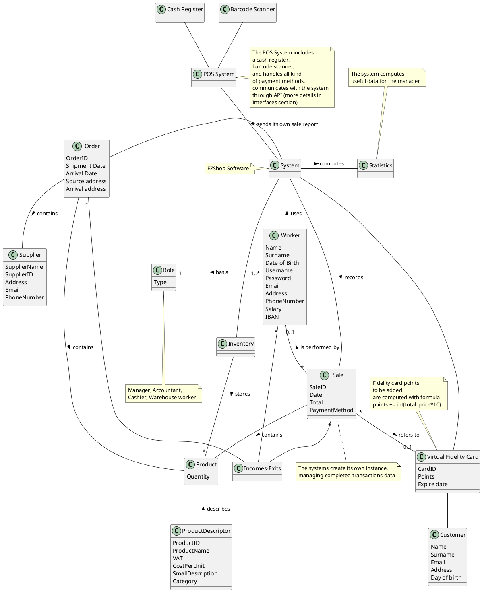
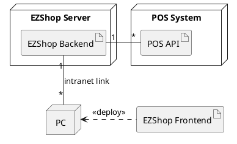

# Requirements Document 

Authors:

Date:

Version:

# Contents

- [Essential description](#essential-description)
- [Stakeholders](#stakeholders)
- [Context Diagram and interfaces](#context-diagram-and-interfaces)
	+ [Context Diagram](#context-diagram)
	+ [Interfaces](#interfaces) 
	
- [Stories and personas](#stories-and-personas)
- [Functional and non functional requirements](#functional-and-non-functional-requirements)
	+ [Functional Requirements](#functional-requirements)
	+ [Access rights](#access-rights)
	+ [Non functional requirements](#non-functional-requirements)
- [Use case diagram and use cases](#use-case-diagram-and-use-cases)
	+ [Use case diagram](#use-case-diagram)
	+ [Use cases](#use-cases)
 	+ [Relevant scenarios](#relevant-scenarios)
- [Glossary](#glossary)
- [System design](#system-design)
- [Deployment diagram](#deployment-diagram) # Essential description Small shops require a simple application to support the owner or manager. A small shop (ex a food shop) occupies 50-200 square meters, sells 500-2000 different item types, has one or a few cash registers EZShop is a software application to: * manage sales * manage inventory * manage customers * support accounting # Stakeholders | Stakeholder name | Description | | ----------------- |:-----------:| | Manager | Manager of the shop, has access to all system functionalities | | Cashier | Employee who deals with customers | | Warehouse worker | Person who handles and organizes items in the inventory | | Supplier | A company that provides a product to be sold | | POS system | Allow the cashiers to manage the sale and the customers to make payments, both with cash or card | | Customer | Person who buys products of the shop | | Business consultant | External person who handles taxes on behalf of shop owner | | Accountant | Person who handles internal accounting, bills and orders | | Analyst | Expert in the software for business domain | | Developer | Person who develops the software | | Mantainer | Person who mantains and install software | # Context Diagram and interfaces ## Context Diagram ```plantuml @startuml rectangle { agent "EZShop Software" as EZS } :Cashier: :Accountant: :Warehouse Worker: :Manager: :Worker: :Worker: <|-- :Cashier: :Worker: <|-- :Accountant: :Worker: <|-- :Warehouse Worker: :Worker: <|-- :Manager: :Worker: -right-> EZS actor "POS System" as POS POS -down-> EZS @enduml ``` ## Interfaces | Actor | Logical Interface | Physical Interface | | ------------- |:-------------:| -----:| | Manager | Desktop GUI | PC | | Cashier | Desktop GUI | PC | | Warehouse worker | Desktop GUI | PC | | Accountant | Desktop GUI | PC | | POS System | Software API (https://www.odoo.com/documentation/14.0/index.html) | Internet Link | # Stories and personas > The following example set of personas refer to the workers of a mini-market.  > However the software is designed to be used by any type of store. ### Manager John, 53, owner of the mini-market, which he has inherited from his parents.  Since he was a child, he witnessed his parents spend a lot of time for the management of all the facets of the mini-market, using paper supports and agendas. He used to do so himself, but now he wants a change of pace in the management department.  He wants to increase productivity and reduce working hours spent at repeating the same tasks with his desk-calculator, so that he can spend more time with his family and friends.  John is not familiar with computer management systems, but is an active social network and eBay worker: he would like a management program which resembles the structure of websites and services he already knows. ### Cashier Maurice is 30 and works as a cashier. He is the worker with the closest relationship to the consumer: for this reason he uses a POS to manage people's purchases and, sometimes, to refund unsatisfied customers. He needs an easy-to-use tool to save every type of transaction that takes place, whether as a sale or as a refund. ### Warehouse worker Ashlen, 23, warehouse worker of the mini-market, is a student-worker.  She works part-time in the market, in order to pay university taxes by herself.  She is a very precise person and likes to keep her workplace well organized and she is always on a tight schedule. She already used an Excel sheet to keep track of the market's inventory: she would like a better-looking and easier to use software to help her in keeping the inventory organized. ### Accountant Mark is 45 years old and has been working as an accountant at EzShop for 15 years. He manages the financial aspects and supports the order management of the shop. He always complains about the paperwork and would like technological support to help him keep track of the shop's performance, including information about orders placed, tax receipts and expenditures, so that he can identify problems immediately and act promptly to resolve them. # Functional and non functional requirements ## Functional Requirements | ID | Description | | ------------- |:-------------:| | FR1 | Manage workers | | -1.1 | Create a new worker | | -1.2 | Modify an existing worker | | -1.3 | Delete a worker | | -1.4 | Show all the workers | | -1.5 | Show personal page | | FR2 | Manage sales | | -2.1 | Process receipt from POS System | | -2.2 | Update inventory | | -2.3 | Update statistics | | --2.3.1 | Update counters for each sale | | --2.3.2 | Update customer statistic | | -2.4 | Show sales history | | -2.5 | Cancel sale | | FR3 | Manage inventory | | -3.1 | Add a new product to all product list | | -3.2 | Remove a product from product list | | -3.3 | Modify an existent product | | --3.3.1 | Modify quantity of a product | | --3.3.2 | Modify name | | --3.3.3 | Modify description | | --3.3.4 | Modify supplier list | | --3.3.5 | Modify price | | --3.3.6 | Modify discount | | -3.4 | List inventory products | | --3.4.1 | List products by filters | | FR4 | Manage accounting | | -4.1 | Manage order | | --4.1.1 | Add a new order | | --4.1.2 | Modify order | | --4.1.3 | Remove order | | -4.2 | List orders | | --4.2.1 | List orders by filters | | -4.3 | List incomes-exits | | --4.3.1 | List by filters | | -4.4 | Show sales statistics | | FR5 | Manage suppliers | | -5.1 | Add supplier | | -5.2 | Modify supplier | | --5.2.1 | Modify contact info | | -5.3 | Remove supplier | | FR6 | Manage customers | | -6.1 | Add a new customer | | -6.2 | Modify an existent customer | | --6.2.1 | Modify contact info | | --6.2.2 | Update fidelity points | | -6.3 | Remove a customer | ## Access rights | Function | Manager | Cashier | Accountant | Warehouse worker | | :------: | :-----: | :-----: | :--------: | :--------------: | | FR1 | Yes | No | No | No | | FR2 | Yes | Yes | No | No | | FR3 | Yes | No | No | Yes | | FR4 | Yes | No | Yes | No | | FR5 | Yes | No | No | No | | FR6 | Yes | Yes | No | No | ## Non Functional Requirements | ID | Type | Description | Refers to FR | | ------------- |:-------------:| :-----:| -----:| | NFR1 | Accuracy | The software must have floating point precision in the order of 10<sup>-4</sup> | All FR | | NFR2 | Security | The shop data can be accessed only by allowed workers | - | | NFR3 | Usability | workers can learn to use software in max 7 days | All FR | | NFR4 | Efficiency | All functions should complete in less than 0.5 second | All FR | | NFR5 | Portability | The software must work on Windows, Linux, Mac OS | All FR | | NFR6 | Reliability | The software must work properly 99% of the time | All FR | | NFR7 | Maintainability | The software must be updated or repaired in max 1 day | All FR | # Use case diagram and use cases ## Use case diagram ```plantuml @startuml top to bottom direction actor Manager actor Cashier actor "Warehouse worker" as WhW actor Accountant actor "POS System" as POS (Manage workers) as UC1 (Manage sales) as UC2 (Sales data update) as UC2.1 (Manage inventory) as UC3 (Show report) as UC3.4 (Manage accounting) as UC4 (Manage suppliers) as UC5 (Manage customers) as UC6 (Authentication) as UC7 UC1 ..> UC7 : <<includes>> UC2 ..> UC7 : <<includes>> UC2 ..> UC2.1 : <<includes>> UC3 ..> UC7 : <<includes>> UC3 ..> UC3.4 : <<includes>> UC4 ..> UC7 : <<includes>> UC5 ..> UC7 : <<includes>> UC6 ..> UC7 : <<includes>> Manager -down-> UC1 Manager -down-> UC2 Manager -down-> UC3 Manager -down-> UC4 Manager -down-> UC5 Manager -down-> UC6 Manager --> UC7 Cashier -up-> UC2 Cashier -up-> UC6 Cashier --> UC7 Accountant -up-> UC4 Accountant --> UC7 WhW -up-> UC3.4 WhW --> UC7 POS --> UC2.1 @enduml ``` ```plantuml @startuml top to bottom direction (Manage worker) as UC1 (Add a new worker) as UC1.1 (Modify a worker) as UC1.2 (Remove a worker) as UC1.3 (Manage sales) as UC2 (Sales data update) as UC2.1 (Manage sales history) as UC2.2 (Manage inventory) as UC3 (Add new product) as UC3.1 (Remove a product) as UC3.2 (Modify a product) as UC3.3 (Show report) as UC3.4 (Manage accounting) as UC4 (Manage order) as UC4.1 (List incoming-exits) as UC4.2 (Show sales statistics) as UC4.3 (Manage suppliers) as UC5 (Add supplier) as UC5.1 (Modify supplier) as UC5.2 (Remove supplier) as UC5.3 (Manage customers) as UC6 (Add new customer) as UC6.1 (Modify a customer) as UC6.2 (Remove a customer) as UC6.3 (Authentication) as UC7 together { UC1 ..> UC1.1 : <<includes>> UC1 ..> UC1.2 : <<includes>> UC1 ..> UC1.3 : <<includes>> UC2 ..> UC2.1 : <<includes>> UC2 ..> UC2.2 : <<includes>> UC3 ..> UC3.1 : <<includes>> UC3 ..> UC3.2 : <<includes>> UC3 ..> UC3.3 : <<includes>> UC3 ..> UC3.4 : <<includes>> } together { UC4 ..> UC4.1 : <<includes>> UC4 ..> UC4.2 : <<includes>> UC4 ..> UC4.3 : <<includes>> UC5 ..> UC5.1 : <<includes>> UC5 ..> UC5.2 : <<includes>> UC5 ..> UC5.3 : <<includes>> UC6 ..> UC6.1 : <<includes>> UC6 ..> UC6.2 : <<includes>> UC6 ..> UC6.3 : <<includes>> } UC1 .down.> UC7 : <<includes>> UC2 ..down.> UC7 : <<includes>> UC3 .down.> UC7 : <<includes>> UC4 .up.> UC7 : <<includes>> UC5 .up.> UC7 : <<includes>> UC6 .up.> UC7 : <<includes>> @enduml ``` ### UC1: Manage worker | Actors Involved | Manager | | ------------- |:-------------:| | Precondition | The system is fully set up and running, actor has an account and logged in | | Post condition | The system is fully running and all workers are aware of the modifications (if they can see them) | | Includes use cases | UC1.1, UC1.2, UC1.3 | | Nominal Scenario | The actor clicks the "Manage worker" tab | ### UC1.1: Add a new worker in the worker list | Actors Involved | Manager | | ------------- |:-------------:| | Precondition | The system is fully set up and running, actor has an account and logged in | | Post condition | The system is fully running and all modifications are saved | | Nominal Scenario | Scenario 1.1.1 | | Variants | 1.1.2 | #### Scenario 1.1.1 | Scenario ID: 1.1.1| Corresponds to UC1.1 | | ------------- |:-------------| | Description | The actor add a new worker to the system | | Precondition | The worker account that has to be inserted doesn't exist | | Postcondition | The new worker account is stored into the system | | Step# | Step description | | 1 | The actor opens the 'worker' page | | 2 | The actor clicks onto the 'Add new worker' button| | 3 | The actor is prompted with filling a form with the required information about the worker | | 4 | The actor fills the form | | 5 | The actor presses the 'Confirm' button | | 6 | If the form is not compiled correctly, the actor is prompted by the system to try again, repeating from step 3. Else, go to next step. | | 7 | The system inserts the new record and the actor is prompted with a 'Success' message | #### Scenario 1.1.2 | Scenario ID: 1.1.2| Variant of UC1.1| | ------------- |:-------------| | Description | The actor tries to add a new worker to the system, but then cancels the operation| | Precondition | The account of the worker that has to be inserted doesn't exist | | Postcondition | No new worker has been inserted in the system | | Step# | Step description | | 1 | The actor opens the 'worker' page | | 2 | The actor clicks onto the 'Add new worker' button| | 3 | The actor is prompted with filling a form with the required information about the worker | | 4 | The actor fills the form | | 5 | The actor presses the 'Confirm' button | | 6 | Since the form is not compiled correctly, the actor is prompted by the system to try again. | | 7 | The actor presses the 'Cancel' button. | | 8 | The system doesn't perform any insertion and the actor is prompted with a 'Insertion canceled' message. | ### UC1.2: Modify a worker field in the worker list | Actors Involved | Manager | | ------------- |:-------------:| | Precondition | The system is fully set up and running, actor has an account and logged in | | Post condition | The system is fully running and all modifications are saved | | Nominal Scenario | Scenario 1.2.1 | | Variants | 1.2.2 | #### Scenario 1.2.1 | Scenario ID: 1.2.1| Corresponds to UC1.2 | | ------------- |:-------------| | Description | The actor modifies an worker record already present in the system| | Precondition | The worker account that has to be modifed does exists | | Postcondition | The system is updated with the new information of the worker| | Step# | Step description | | 1 | The actor opens the 'worker' page | | 2 | The actor clicks onto the 'Modify' button on the box of 'worker A' | | 3 |The actor is prompted with a form with the modifiable information about the worker | | 4 | The actor clicks onto the field to modify| | 5 | The actor modifies the field to modify | | 6 | The actor presses the 'Confirm' button | | 7 | If the form is not compiled correctly, the actor is prompted by the system to try again, repeating from step 3. Else, go to next step | | 8 | The system modifies the record and the actor is prompted with a 'Success' message | #### Scenario 1.2.2 | Scenario ID: 1.2.2 | Variant of UC1.2 | | ------------- |:-------------| | Description | The actor tries to modify a worker record already present in the system, but then cancels the operation| | Precondition | The worker account that has to be modifed does exists | | Postcondition | No existing worker has been modified in the system | | Step# | Step description | | 1 | The actor opens the 'worker' page | | 2 | The actor clicks onto the 'Modify' button on the box of 'worker A' | | 3 | The actor is prompted with a form with the modifiable information about the worker | | 4 | The actor clicks onto the field to modify | | 5 | The actor modifies the field to modify | | 6 | The actor presses the 'Confirm' button | | 7 | Since the form is not compiled correctly, the actor is prompted by the system to try again. | | 8 | The actor presses the 'Cancel' button | | 9 | The system doesn't perform any modification and the actor is prompted with a 'Modification canceled' message | ### UC1.3: Remove a worker from the worker list | Actors Involved | Manager | | ------------- |:-------------:| | Precondition | The system is fully set up and running, actor has an account and logged in | | Post condition | The system is fully running and all modifications are saved | | Nominal Scenario | Scenario 1.3.1 | | Variants | 1.3.2 | #### Scenario 1.3.1 | Scenario ID: 1.3.1| Corresponds to UC1.3 | | ------------- |:-------------| | Description | The actor delete an worker record already present in the system| | Precondition | The account of the worker thas has to be deleted does exists | | Postcondition | The worker account doesn't exist anymore into the system| | Step# | Step description | | 1 | The actor opens the 'worker' page| | 2 | The actor clicks onto the 'Remove' button on the box of 'worker A' | | 3 | The actor is prompted with a 'Are you sure you want to remove this record?' message box | | 4 | The actor clicks onto the 'Confirm' button. | | 5 | The system removes the record and the actor is prompted with a 'Success' message | #### Scenario 1.3.2 | Scenario ID: 1.3.2 | Variant of UC1.3 | | ------------- |:-------------| | Description | The actor tries to remove a worker record already present in the system, but then cancels the operation | | Precondition | The account of the worker thas has to be deleted does exists | | Postcondition | No previously existing worker has been removed from the system | | 1 | The actor opens the 'worker' page | | 2 | The actor clicks onto the 'Remove' button on the box of 'worker A' | | 3 | The actor is prompted with a 'Are you sure you want to remove this worker?' message box | | 4 | The actor clicks onto the 'Cancel' button. | | 5 | The system resumes from the 'worker' page | ### UC2: Manage Sales | Actors Involved | Manager, Cashier | | ------------- |:-------------:| | Precondition | The software is fully set up, actor has an account and logged in | | Post condition | The software system is fully running and coherent with sales updates| | Include uses cases | UC2.1, UC2.2 | | Nominal scenario | The actor clicks the "Manage Sale" tab | ### UC2.1: Software data are updated after payment | Actors Involved | Manager, Cashier, POS System | | ------------- |:-------------:| | Precondition | The POS system is connected to internet and it is well functioning, the software receives the items sold from the POS system, which already knows how products are mapped. The payment ( with cash or credit card) is already completed | | Post condition | The system is fully running and all new data are correctly saved | | Nominal Scenario | Scenario 2.1.1| | Variants | 2.1.2 | #### Scenario 2.1.1 | Scenario ID: 2.1.1| Corresponds to UC2.1 | | ------------- |:-------------| | Description | The software updates inventory, sale history and sale statistics databases | | Precondition | - | | Postcondition | - | | Step# | Step description | | 1 | POS system transfer sale's data to the software | | 2 | The software check the ID of the product | | 3 | The software check the quantity sold of the product and update the availability of the product | | 4 | Repeat steps 2-3 for all products | | 5 | The software compute the total amount of earned money of the sale | | 6 | The software update the total income of the shop | | 7 | The software save the receipt on the sale history database| | 8 | All databases have been updates successfully and the actor is prompted with a 'Success' message.| #### Scenario 2.1.2 | Scenario ID: 2.1.2 | Variant of UC2.1| | ------------- |:-------------| | Description | The software update also the statistics based on the total number of point earned by the customer | | Precondition | The customer is registered and has a fidelity card | | Postcondition | - | | Step# | Step description | | 1 | POS system transfer sale's data to the software | | 2 | The software check the ID of the products | | 3 | The software check the quantity sold of the product and update the availability of the product | | 4 | Repeat 2-3 for all products | | 5 | The software check the total amount of earned money of the sale | | 6 | The software update the total income of the shop| | 8 | The software save the receipt on the sale history database | | 9 | The system check for the customer virtual fidelity card | | 10 | The system update the total amount of points of the customer by adding points | | 11 | All databases have been updates successfully and the actor is prompted with a 'Success' message | ### UC2.2: Manage Sales History | Actors Involved | Manager, Cashier | | ------------- |:-------------:| | Precondition | All sales are recorded with receipt info and stored after the payment | | Post condition | The software is fully running and coherent with sales history updates | | Nominal Scenario | Scenario 2.2.1 | | Variants | Scenario 2.2.2, Scenario 2.2.3 | #### Scenario 2.2.1 | Scenario ID: 2.2.1 | Corresponds to UC2.2 | | ------------- |:-------------| | Description | The actor control the sale history on a specific date and time| | Precondition | - | | Postcondition | Sale History database it is consistent with the actual number of sales | | Step# | Step description | | 1 | The actor opens the 'Sales History' page| | 2 | The system shows the list of all receipt registred in the system | | 3 | The actor can choose to filter the list based on the date info | | 4 | If there aren't sales in that date the actor is prompeted with a 'No sales registred on this date' message | #### Scenario 2.2.2 | Scenario ID: 2.2.2 | Variant of UC2.2 | | ------------- |:-------------| | Description | The actor successfully cancel a sale because the customer wants to be totally refunded | | Precondition | The sale that has to be deleted is stored in the system | | Postcondition | The sale is permanently removed from the system, the returned products, if not damaged, have to be registred to the inventory database | | Step# | Step description | | 1 | The actor opens the 'Sales History' page | | 2 | The software shows the list of all receipt registred in the system| | 3 | The actor can choose to filter the list based on the date and time info | | 4 | The actor find the the corresponding sale to be removed | | 5 | The actor clicks onto the 'cancel all' button on the box of 'Sale A' | | 6 | The actor is prompted with a 'Are you sure you want to remove this Sale?' message box | | 7 | The actor clicks onto the 'Confirm' button. | | 8 | The software check the total amount of earned money from the sale | | 9 | The software update the total income of the shop by subtracting the amount earned | | 10 | The system removes the sale and the actor is prompted with a 'Success' message | #### Scenario 2.2.3 | Scenario ID: 2.2.3 | Variant of UC2.2 | | ------------- |:-------------| | Description | The customer only wants to return a specific product, the actor successfully cancel a specific product of a sale| | Precondition | The product that has to be deleted is stored in the system | | Postcondition | The product is permanently removed from the system, the returned product, if not damaged, have to be registred to the inventory database | | Step# | Step description | | 1 | The actor opens the 'Sales History' page | | 2 | The software shows the list of all receipt registred in the system | | 3 | The actor can choose to filter the list based on the date and time info | | 4 | The actor find the the corresponding sale to be modify | | 5 | The actor clicks onto the 'cancel' button on the box of 'Product B' of 'Sale A' | | 6 | The actor is prompted with a 'Are you sure you want to remove this product?' message box | | 7 | The actor clicks onto the 'Confirm' button. | | 8 | The software check the total product price | | 9 | The software update the total income of the shop by subtracting the total product price | | 10 | The system removes the product and the actor is prompted with a 'Success' message | ## Use case 3, UC3 - Manage inventory | Actors Involved | Manager, Warehouse worker | | :----------------: | :--------------------- | | Precondition | The system is running, the actor is logged in and has the correct access rights | | Post condition | The system is running and consistent with the changes made in the inventory | | Includes use cases | UC3.1, UC3.2, UC3.3, UC3.4 | | Nominal scenario | Actor clicks the "Manage Inventory" tab | ### Use case 3.1, UC3.1 - Add a new product to all product list  | Actors Involved | Manager, Warehouse worker | | :-------------: | :------------------------------------- | | Precondition | Actor has an account and is logged in | | Post condition | The product list is modified | | Nominal Scenario | Scenario 3.1.1 | | Variants | Scenario 3.1.2 | #### Scenario 3.1.1 | Scenario 3.1.1 | Corresponds to UC3.1 | | :-------------: | :-------------- | | Precondition | The product P does not exist in the product list | | Post condition | The product P is added to the product list | | Step# | Description | | 1 | The Actor creates a new product P | | 2 | The actor enters (in a correct way) the necessary fields of the product (name, quantity, description, supplier list, price, discount, quantity threshold) | | 3 | The actor confirms the operation | | 4 | The system checks all the entries in the product list and recognizes that the product does not exist | | 5 | The system confirms the operation and notifies the actor | #### Scenario 3.1.2 | Scenario 3.1.2 | Variant of UC3.1 | | :-------------: | :-------------- | | Precondition | The product P already exists in the product list | | Post condition | The product P is not added to the product list | | Step# | Description | | 1 | The actor creates a new product P | | 2 | The actor enters (in a correct way) the necessary fields of the product (name, quantity, description, supplier list, price, discount, quantity threshold) | | 3 | The actor confirms the operation | | 4 | The system checks all the entry on the product list and recognizes that the product already exists | | 5 | The system cancels the operation and notifies the actor | ### Use case 3.2, UC3.2 - Remove a product from product list  | Actors Involved | Manager, Warehouse worker | | :-------------: | :------------------------------------- | | Precondition | Actor has an account and is logged in | | | The product already exists in the product list | | Post condition | The product list is modified | | Nominal Scenario | Scenario 3.2.1 | | Variants | Scenario 3.2.2, Scenario 3.2.3 | #### Scenario 3.2.1 | Scenario 3.2.1 | Corresponds to UC3.2 | | :-------------: | :------------------ | | Precondition | Same of UC3.2 | | Post condition | The product P is removed from the product list | | Step# | Description | | 1 | The actor selects a product P from the product list | | 2 | The system checks if there are instances of the product P in the inventory | | 3 | The system verifies that there are no instances of product P in inventory and notifies it to the actor | | 4 | The system asks the actor for confirmation | | 5 | The actor confirms the operation | | 6 | The system deletes the product P from the product list | #### Scenario 3.2.2 | Scenario 3.2.2 | Variant of scenario 3.2.1 | | :-------------: | :----------------------- | | Precondition | Same of UC3.2 | | Post condition | The product P is removed from the product list (may cause inconsistency of the system) | | Step# | Description | | 1 | The actor selects a product P from the product list | | 2 | The system checks if there are instances of the product P in the inventory | | 3 | The system verifies that there are instances of product P in inventory and warns the actor that deleting the product P from the product list may cause system inconsistency | | 4 | The system asks the actor for confirmation | | 5 | The actor confirms the operation | | 6 | The system deletes the product P from the product list | #### Scenario 3.2.3 | Scenario 3.2.3 | Variant of UC3.2 | | :-------------: | :-------------- | | Precondition | Same of UC3.2 | | Post condition | The product P is not removed from the product list | | Step# | Description | | 1 | The actor selects a product P from the product list | | 2 | The system checks if there are instances of the product P in the inventory | | 3 | The system notifies the actor and asks for confirmation | | 4 | The actor does not confirm the operation | ### Use case 3.3, UC3.3 - Modify a product  | Actors Involved | Manager, Warehouse worker | | :-------------: | :-------------------------| | Precondition | Actor worker has an account and is logged in | | | The product already exists in the product list | | Post condition | The product P is modified | | Nominal Scenario | Scenario 3.3.1 | | Variants | Scenario 3.3.2 | #### Scenario 3.3.1 | Scenario 3.3.1 | Corresponds to UC3.3 | | :-------------: | :-------------------| | Precondition | Same of UC3.3 | | Post condition | The product P is modified | | Step# | Description | | 1 | The actor selects a product P from the product list | | 2 | The actor modifies one or more fields (name, description, quantity, supplier list, price, discount, quantity threshold) of the product P | | 3 | The system notifies the actor and asks for confirmation | | 4 | The actor confirms the operation | | 5 | The system updates the product P in the product list | #### Scenario 3.3.2 | Scenario 3.3.2 | Variant of UC3.3 | | :-------------: | :---------------| | Precondition | Same of UC3.3 | | Post condition | The product P is not modified | | Step# | Description | | 1 | The actor selects a product P from the product list | | 2 | The actor modifies one or more fields (name, description, quantity, supplier list, price, discount, quantity threshold) of the product P | | 3 | The system notifies the actor and asks for confirmation | | 4 | The actor confirms the operation | ### Use case 3.4, UC3.4 - Show report of the inventory | Actors Involved | Manager, Warehouse worker | | :-------------: | :------------------------------------- | | Precondition | Actor has an account and is logged in | | | There is, at least, one product in the product list | | Post condition | The system show a report of the inventory | | Nominal Scenario | Scenario 3.4.1 | | Variants | Scenario 3.4.2, Scenario 3.4.3 | #### Scenario 3.4.1 | Scenario 3.4.1 | Corresponds to UC3.4 | | :-------------: | :------------------ | | Precondition | Same of UC3.4 | | Post condition | The system shows an overall view of the inventory | | Step# | Description | | 1 | The actor selects "Report of the inventory" | | 2 | The system shows all the products in the product list and the relative fields | #### Scenario 3.4.2 | Scenario 3.4.2 | Variant of scenario 3.4.1 | | :------------: | :------------------ | | Precondition | Same of UC3.4 | | | The actor has reached the 2nd step of scenario 3.4.1 | | Post condition | The system shows the N most sold products | | Step# | Description | | 1 | The actor selects "Show most sold products" | | 2 | The system asks for the number N of products to shown | | 3 | The actor selects the number N of products | | 4 | The system shows the N most sold products in decreasing order | #### Scenario 3.4.3 | Scenario 3.4.3 | Variant of scenario 3.4.1 | | :-------------: | :----------------------- | | Precondition | Same of UC3.4 | | | The actor reached the 2nd step of scenario 3.4.1 | | Post condition | The system shows all the products that are almost out-of-stock | | Step# | Description | | 1 | The actor selects "Show almost out-of-stock products" | | 2 | The system checks the quantity of every product. If the quantity, for a certain product in the inventory, is below the quantity threshold (previously selected in UC1 by the actor) the product will be considered almost out-of-stock | | 3 | The system shows the almost out-of-stock products in decreasing order | ## UC4: Manage accounting | Actors Involved | Manager, Accountant | | --------------- | :-----------------: | | Precondition | The system is running, the actor is logged in and has the correct access rights | | Post condition | The system is running and consistent with the changes made (if any) | | Includes use cases | UC4.1, UC4.2, UC4.3 | | Nominal scenario | The actor clicks onto the 'Management' tab, all options are shown | | Variants | - | ---  ### UC4.1: Manage order | UC4.1 | Manage order | | ----- | ------------ | | Precondition | The system is running, the actor is logged in and has the correct access rights | | Post condition | The system is running, all modifications are saved | | Nominal scenario | 4.1.1 | | Variants | 4.1.2, 4.1.3, 4.1.4, 4.1.5, 4.1.6 | #### Scenario 4.1.1 | Scenario 4.1.1 | Corresponds to UC 4.1 | | -------------- | --------------- | | Description | The logged actor wants to add a new order | | Precondition | Order O doesn't exist | | Post condition | The new order O has been saved in the system | | Step # | Step description | | 1 | The actor opens the 'Orders' page (clicking on corresponding tab) | | 2 | The actor clicks onto the 'Add new order' button | | 3 | The actor fills the fields with the required information about the new order O | | 4 | The actor clicks onto the 'Confirm' button | | 5 | If the form is not compiled correctly, the actor is prompted by the system to try again, repeating from step. Else, go to next step | | 6 | The system insterts the new record and the actor is prompted with a 'Success' message | #### Scenario 4.1.2 | Scenario 4.1.2 | Variant of scenario 4.1.1 | | ----- | ------ | | Description | The actor tries to add a new order and cancels the operation | | Precondition | Order O doesn't exist | | Post condition | No modification to system has been made | | Step # | Step description | | 1 | The actor opens the 'Orders' page (clicking on corresponding tab) | | 2 | The actor clicks onto the 'Add new order' button | | 3 | The actor fills the fields with the required information about the new order O | | 4 | The actor click onto the 'Cancel' button | | 5 | The system takes the actor to 'Orders' page and doesn't record any modification | #### Scenario 4.1.3 | Scenario 4.1.3 | Corresponds to UC 4.1 | | -------------- | --------------------- | | Description | The actor modifies an existent order | | Precondition | Order O exists | | Postcondition | Order O fields are modified | | Step # | Step description | | 1 | The actor opens the 'Orders' page (clicking on corresponding tab) | | 2 | The actor clicks the order O that wants to modify | | 3 | The system shows the order page | | 4 | The actor modifies the fields | | 5 | The actor clicks onto 'Confirm' button | | 6 | The system saves the modification and shows 'Success' message | #### Scenario 4.1.4 | Scenario 4.1.4 | Variant of scenario 4.1.3 | | -------------- | --------------------- | | Description | The actor wants to modify an existent order, then cancels the operation | | Precondition | Order O exists | | Postcondition | Order O fields are modified | | Step # | Step description | | 1 | The actor opens the 'Orders' page (clicking on corresponding tab) | | 2 | The actor clicks the order O that wants to modify | | 3 | The system shows the order page | | 4 | The actor modifies the fields | | 5 | The actor clicks onto 'Cancel' button | | 6 | The system takes the actor to the order page with original Order fields #### Scenario 4.1.5 | Scenario 4.1.5 | Corresponds to UC 4.1 | | -------------- | --------------------- | | Precondition | Order O exists, its state is 'created' | | Postcondition | Order O removed from the system | | Step # | Step description | | 1 | The actor opens the 'Orders' page (clicking on corresponding tab) | | 2 | The actor clicks the order O that wants to remove | | 3 | The system shows the order page | | 4 | The actor clicks onto 'Delete' button | | 5 | The system removes the order and takes the actor to 'Orders' page, showing 'Succes' message | #### Scenario 4.1.6 | Scenario 4.1.6 | Variant of scenario 4.1.5 | | -------------- | ----------------------------- | | Description | The actor tries to remove an order with a state different to 'created' or 'shipped' | | Precondition | Order O exists, its state is different to 'created' or 'shipped' | | Postcondition | Order O is not removed from the system | | Step # | Step description | | 1 | The actor opens the 'Orders' page (clicking on corresponding tab) | | 2 | The actor clicks the order O that wants to remove | | 3 | The system shows the order page | | 4 | The actor clicks onto 'Delete' button | | 5 | The system shows 'Error' message, the order can't be removed due to its state| ### UC4.2: List incoming-exits | UC4.2 | List incoming-exits | | ----- | ------------ | | Precondition | The system is running, the actor is logged in and has the correct access rights | | Post condition | The system is running | | Nominal scenario | The actor clicks onto the 'Incoming-Exits' link, the system shows the page with the reports about incoming-exits | | Variant #1 | There are no reports to be shown, the system shows a blank page | | Variant #2 | The actor selects one or more filter, the system shows the page with the reports applying selected filter(s) | #### Scenario 4.2.1 | Scenario 4.2.1 | Corresponds to UC 4.2 | | -------------- | ----------------------------- | | Description | The actor wants to knows incoming-exits | | Precondition | There are incoming-exits to show | | Postcondition | The system is running, all required information are shown | | Step # | Step description | | 1 | The actor clicks onto the 'Incoming-exits' link | 2 | The system takes the actor to the selected page | 3 | The system shows the reports about incoming-exits #### Scenario 4.2.2 | Scenario 4.2.2 | Variant of scenario 4.2.2 | | -------------- | ------------------------- | | Description | The actor wants to know incoming-exits, but there are no information to show | | Precondition | There are no information about incoming-exits | | Postcondition | - | | Step # | Step description | | 1 | The actor clicks onto the 'Incoming-exits' link | 2 | The system shows a blank page with an information message ### UC4.3: Show sales statistics | UC4.3 | Show sales statistics | | ----- | ------------ | | Precondition | The system is running, the actor is logged in and has the correct access rights | | Post condition | The system is running, all modifications are saved | | Nominal scenario | 4.3.1 | | Variants | 4.3.2 | #### Scenario 4.3.1 | Scenario 4.3.1 | Corresponds to UC 4.3 | | -------------- | --------------------- | | Description | The actor wants to know sales statistics | | Precondition | There are statistics to show | | Postcondition | The system is running, all required information are shown | | Step # | Step description | | 1 | The actor clicks onto the 'Sales statistics' link | 2 | The system takes the actor to the selected page | 3 | The system shows the reports about sales #### Scenario 4.3.2 | Scenario 4.3.2 | Variant of scenario 4.2.1 | | -------------- | ------------------------- | | Description | The actor wants to know sales statistics | | Precondition | There are no statistics to show | | Postocondition | - | | Step # | Step description | | 1 | The actor clicks onto the 'Sales statistics' link | 2 | The system shows a blank page with an information message  ### UC5: Manage Suppliers | Actors Involved | Manager | | ------------- |:-------------:| | Precondition | The system is fully set up and running, a manager account is defined and logged in. | | Post condition | The system is fully running, coherent and all workers are aware of the modifications. | | Nominal Scenario | 5.1.1 | | Variants | 5.1.2, 5.2.1, 5.2.2, 5.3.1, 5.3.2 | #### Scenario 5.1.1 | Scenario ID: 5.1.1 | Corresponds to UC 5 | | ------------- |:-------------| | Description | A manager worker successfully adds a new supplier to the system. | | Precondition | See UC5 | | Postcondition | A new supplier object has been inserted in the system. | | Step# | Step description | | 1 | The actor opens the 'Suppliers' page (click on corresponding tab). | | 2 | The actor clicks onto the 'Add new supplier' button. | | 3 | The actor is prompted with filling a form with the required information about the supplier. | | 4 | The actor fills the form. | | 5 | The actor presses the 'Confirm' button. | | 6 | If the form is not compiled correctly, the actor is prompted by the system to try again, repeating from step 3, keeping the correct entries and outlining the wrong ones. Else, go to next step. | | 7 | The system inserts the new record and the actor is prompted with a 'Success' message. | #### Scenario 5.1.2 | Scenario ID: 5.1.2 | Variant of scenario 5.1.1 | | ------------- |:-------------| | Description | A manager worker tries to add a new supplier to the system, but then cancels the operation. | | Precondition | See UC5. | | Postcondition | No new supplier object has been inserted in the system. | | Step# | Step description | | 1 | The actor opens the 'Suppliers' page (click on corresponding tab). | | 2 | The actor clicks onto the 'Add new supplier' button. | | 3 | The actor is prompted with filling a form with the required information about the supplier. | | 4 | The actor fills the form. | | 5 | The actor presses the 'Confirm' button. | | 6 | Since the form is not compiled correctly, the actor is prompted by the system to try again. | | 7 | The actor presses the 'Cancel' button. | | 8 | The system doesn't perform any insertion and the actor is prompted with a 'Insertion canceled' message. | #### Scenario 5.2.1 | Scenario ID: 5.2.1 | Corresponds to UC 5.2 | | ------------- |:-------------| | Description | A manager worker successfully modifies a supplier record already present in the system. | | Precondition | At least a supplier exists. | | Postcondition | An existing supplier object has been correctly modified in the system. | | Step# | Step description | | 1 | The actor opens the 'Suppliers' page (click on corresponding tab). | | 2 | The actor clicks onto the 'Modify' button on the box of 'Supplier A'. | | 3 | The actor is prompted with a form with the modifiable information about the supplier. | | 4 | The actor clicks onto 'Field X' field. | | 5 | The actor modifies the 'Field X' field. | | 6 | The actor presses the 'Confirm' button. | | 7 | If the form is not compiled correctly, the actor is prompted by the system to try again, repeating from step 3. Else, go to next step. | | 8 | The system modifies the record and the actor is prompted with a 'Success' message. | #### Scenario 5.2.2 | Scenario ID: 5.2.2 | Variant of scenario 5.2 | | ------------- |:-------------| | Description | A manager worker tries to modify a supplier record already present in the system, but then cancels the operation. | | Precondition | At least a supplier exists. | | Postcondition | No existing supplier object has been modified in the system. | | Step# | Step description | | 1 | The actor opens the 'Suppliers' page (click on corresponding tab). | | 2 | The actor clicks onto the 'Modify' button on the box of 'Supplier A'. | | 3 | The actor is prompted with a form containing the modifiable information about the supplier. | | 4 | The actor clicks onto the 'Field X' field. | | 5 | The actor modifies the 'Field X' field. | | 6 | The actor presses the 'Confirm' button. | | 7 | Since the form is not compiled correctly, the actor is prompted by the system to try again. | | 8 | The actor presses the 'Cancel' button. | | 9 | The system doesn't perform any modification and the actor is prompted with a 'Modification canceled' message. | #### Scenario 5.3.1 | Scenario ID: 5.3.1 | Corresponds to UC 5.3 | | ------------- |:-------------| | Description | A manager worker successfully removes a supplier record already present in the system | | Precondition | At least a supplier exists. | | Postcondition | A previously existing supplier object has been correctly removed from the system | | Step# | Step description | | 1 | The actor opens the 'Suppliers' page (click on corresponding tab). | | 2 | The actor clicks onto the 'Remove' button on the box of 'Supplier A'. | | 3 | The system checks if there are any pending orders from that supplier, it doesn't find any. | | 4 | The actor is prompted with a 'Are you sure you want to remove this record?' message box. | | 5 | The actor clicks onto the 'Confirm' button. | | 6 | The system removes the record and the actor is prompted with a 'Success' message. | #### Scenario 5.3.2 | Scenario ID: 5.3.2 | Variant of scenario 5.3 | | ------------- |:-------------| | Description | A manager worker tries to remove a supplier record already present in the system, but then cancels the operation. | | Precondition | At least a supplier exists. | | Postcondition | No previously existing supplier object has been removed from the system | | Step# | Step description | | 1 | The actor opens the 'Suppliers' page (click on corresponding tab). | | 2 | The actor clicks onto the 'Remove' button on the box of 'Supplier A'. | | 3 | The system checks if there are any pending orders from that supplier, it finds at least one. | | 4 | The system doesn't perform any removal and the actor is prompted with a 'Supplier cannot be removed' message box. | | 5 | The actor clicks onto the 'Ok' button. | | 6 | The system resumes from the 'Suppliers' page. | ### UC6: Manage Customers | Actors Involved | Manager, Cashier | | ------------- |:-------------:| | Precondition | The system is fully set up and running, a Manager/Cashier account is defined and logged in. | | Post condition | The system is fully running, coherent and all workers are aware of the modifications. | | Nominal Scenario | 6.1.1 | | Variants | 6.1.2, 6.2.1, 6.2.2, 6.3.1, 6.3.2 | #### Scenario 6.1.1 | Scenario ID: 6.1.1 | Corresponds to UC 6.1 | | ------------- |:-------------| | Description | An actor successfully adds a new customer to the system. | | Precondition | See UC6 | | Postcondition | A new customer object has been inserted in the system. | | Step# | Step description | | 1 | The actor opens the 'Customers' page (click on corresponding tab). | | 2 | The actor clicks onto the 'Add new customer' button. | | 3 | The actor is prompted with filling a form with the required information about the customer. | | 4 | The actor fills the form. | | 5 | The actor presses the 'Confirm' button. | | 6 | If the form is not compiled correctly, the actor is prompted by the system to try again, repeating from step 3. Else, go to next step. | | 7 | The system inserts the new record and the the actor is prompted with a 'Success' message. | #### Scenario 6.1.2 | Scenario ID: 6.1.2 | Variant of scenario 6.1 | | ------------- |:-------------| | Description | An actor tries to add a new customer to the system, but then cancels the operation. | | Precondition | See UC6 | | Postcondition | No new customer object has been inserted in the system. | | Step# | Step description | | 1 | The actor opens the 'Customers' page (click on corresponding tab). | | 2 | The actor clicks onto the 'Add new customer' button. | | 3 | The actor is prompted with filling a form with the required information about the customer. | | 4 | The actor fills the form. | | 5 | The actor presses the 'Confirm' button. | | 6 | Since the form is not compiled correctly, the actor is prompted by the system to try again. | | 7 | The actor presses the 'Cancel' button. | | 8 | The system doesn't perform any insertion and the actor is prompted with a 'Insertion canceled' message. | #### Scenario 6.2.1 | Scenario ID: 6.2.1 | Corresponds to UC 6.2 | | ------------- |:-------------| | Description | An actor successfully modifies a customer record already present in the system. | | Precondition | At least one customer record exists. | | Postcondition | An existing customer object has been correctly modified in the system. | | Step# | Step description | | 1 | The actor opens the 'Customers' page (click on corresponding tab). | | 2 | The actor clicks onto the 'Search' button, writes 'Name X Surname Y' and presses enter. | | 3 | The actor clicks onto the 'Modify' button on the box of customer 'Name X Surname Y'. | | 4 | The actor is prompted with a form with the modifiable information about the customer. | | 5 | The actor clicks onto the 'Field X' field. | | 6 | The actor modifies the 'Field X' field. | | 7 | The actor presses the 'Confirm' button. | | 8 | If the form is not compiled correctly, the actor is prompted by the system to try again, repeating from step 4. Else, go to next step. | | 9 | The system modifies the record and the actor is prompted with a 'Success' message. | #### Scenario 6.2.2 | Scenario ID: 6.2.2 | Variant of scenario 6.2.1 | | ------------- |:-------------| | Description | An actor worker tries to modify a customer record already present in the system, but then cancels the operation. | | Precondition | At least one customer record exists. | | Postcondition | No existing customer object has been modified in the system. | | Step# | Step description | | 1 | The actor opens the 'Customers' page (click on corresponding tab). | | 2 | The actor clicks onto the 'Search' button, writes 'Name X Surname Y' and presses enter. | | 3 | The actor clicks onto the 'Modify' button on the box of customer 'Name X Surname Y'. | | 4 | The actor is prompted with a form containing the modifiable information about the customer. | | 5 | The actor clicks onto the 'Field X' field. | | 6 | The actor modifies the 'Field X' field. | | 7 | The actor presses the 'Confirm' button. | | 8 | Since the form is not compiled correctly, the actor is prompted by the system to try again. | | 9 | The actor presses the 'Cancel' button. | | 10 | The system doesn't perform any modification and the actor is prompted with a 'Modification canceled' message. | #### Scenario 6.3.1 | Scenario ID: 6.3.1 | Corresponds to UC 6.3 | | ------------- |:-------------| | Description | An actor successfully removes a customer record already present in the system | | Precondition | At least one customer record exists. | | Postcondition | A previously existing customer object has been correctly removed from the system | | Step# | Step description | | 1 | The actor opens the 'Customers' page (click on corresponding tab). | | 2 | The actor clicks onto the 'Search' button, writes 'Name X Surname Y' and presses enter. | | 3 | The actor clicks onto the 'Remove' button on the box of customer 'Name X Surname Y'. | | 4 | The system checks if there are any leftover fidelity points from that customer, it doesn't find any. | | 5 | The actor is prompted with a 'Are you sure you want to remove this record?' message box. | | 6 | The actor clicks onto the 'Confirm' button. | | 7 | The system removes the record and the actor is prompted with a 'Success' message. | #### Scenario 6.3.2 | Scenario ID: 6.3.2 | Variant of scenario 6.3 | | ------------- |:-------------| | Description | A Manager/Cashier worker tries to remove a customer record already present in the system, but then cancels the operation. | | Precondition | At least one customer record exists. | | Postcondition | No previously existing customer object has been removed from the system | | Step# | Step description | | 1 | The actor opens the 'Customers' page (click on corresponding tab). | | 2 | The actor clicks onto the 'Remove' button on the box of 'customer A'. | | 3 | The system checks if there are any leftover fidelity points from that customer, it finds at least one. | | 4 | The actor is prompted with a 'Are you sure you want to remove this record? All points will be lost' message box. | | 5 | The actor clicks onto the 'Cancel' button. | | 6 | The system resumes from the 'customers' page. | ### UC7: Authentication | Actors Involved | Manager, Accountant, Cashier, Warehouse worker | | ------------- |:-------------:| | Precondition | The system is fully set up and running, the actor is not yet logged in | | Post condition | The system is fully running. | | Nominal Scenario | 7.1 | | Variants | 7.2 | #### Scenario 7.1 | Scenario ID: 7.1 | Corresponds to UC 7 | | ------------- |:-------------| | Description | The actor tries to log in the system | | Precondition | The worker inserts correct credentials | | Postcondition | The actor is logged in the system |
| Step# | Step description |
| 1 | The actor opens the log-in page. |
| 2 | The actor inserts his manager-defined credentials. |
| 3 | The system checks the credentials. |
| 4 | The actor is logged in the system and has access to his own functionalities. |

#### Scenario 7.2

| Scenario ID: 7.2 | Variant of scenario 7.1 |
| ------------- |:-------------|
| Description | The actor tries to log in the system |
| Precondition | The worker inserts wrong credentials |
| Postcondition | The actor is not logged in the system |
| Step# | Step description |
| 1 | The actor opens the log-in page. |
| 2 | The actor inserts some credentials. |
| 3 | The system checks the credentials. |
| 4 | The actor is not logged in the system. |

# Glossary

## POS System specifications
The application is compatible with any POS system able to run on an odoo-derived OS.
This ensures the communication between the POS system and the EZShop system through odoo's external APIs.

# System Design
\<describe here system design>

\<must be consistent with Context diagram>

# Deployment Diagram 

